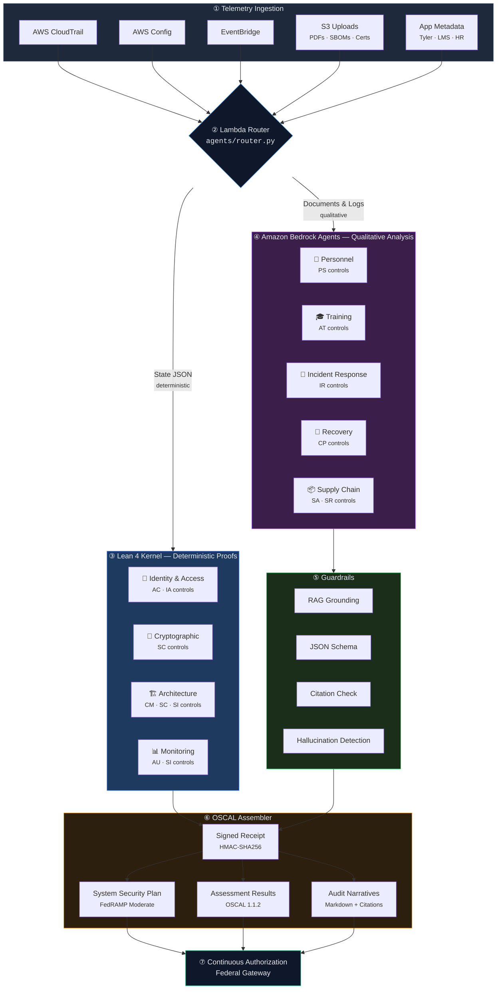

# FedCloud — Formal Verification Gateway for Federal Cloud Authorizations

[](https://github.com/j-arndt/fedcloud/actions/workflows/ci.yml)
[](https://j-arndt.github.io/fedcloud/)
[](https://lean-lang.org/)
[](https://pages.nist.gov/OSCAL/)
[](https://python.org/)
[](https://github.com/j-arndt/fedcloud/actions/workflows/ci.yml)

**Replace compliance narratives with mathematical proofs.**

> **[Read the full documentation →](https://j-arndt.github.io/fedcloud/)**

FedCloud automates continuous compliance verification using a hybrid dual-engine architecture: a [Lean 4](https://lean-lang.org/) kernel for deterministic mathematical proofs on structural controls, and [Amazon Bedrock](https://aws.amazon.com/bedrock/) agents for qualitative semantic analysis on policy-heavy controls. Both engines produce outputs that are assembled into [OSCAL](https://pages.nist.gov/OSCAL/) artifacts for continuous authorization.

---

## Architecture



## Hybrid Architecture

The system routes each control cluster to the appropriate verification engine based on control type:

- **Deterministic controls** (structural, binary-verifiable) go to the **Lean 4 Kernel**, which produces mathematical proofs. Same input always yields the same result, and every proof is independently checkable.
- **Qualitative controls** (policy-heavy, context-dependent) go to **Amazon Bedrock Agents**, which perform semantic analysis grounded via RAG retrieval against policy document knowledge bases. Guardrails validate outputs and suppress hallucinations before results are accepted.

A router (`agents/router.py`) classifies incoming telemetry and dispatches each cluster to the correct engine. Both engines emit structured findings that the OSCAL Assembler merges into a unified SSP and Assessment Results document.

## Security Clusters

The gateway covers nine security clusters across two engines.

### Deterministic Clusters (Lean 4 Kernel)

| Cluster | Invariant | Controls |
|---------|-----------|----------|
| **Identity & Access** | Privileged sessions require phishing-resistant MFA; tokens ≤ 60 min | AC-2, AC-3, AC-6, IA-2, IA-5 |
| **Cryptographic Protection** | Federal data encrypted at rest with FIPS-140-3 modules | SC-8, SC-12, SC-13, SC-28 |
| **Architecture Immutability** | Signed images only; no shell access; no open ingress | CM-2, CM-6, CM-7, SC-7, SI-7 |
| **Continuous Monitoring** | Active logging to tamper-evident targets; ≥ 365-day retention | AU-2, AU-6, AU-9, AU-11, SI-4 |

Each invariant is expressed as a formal Lean 4 theorem with a corresponding decision procedure that produces concrete verification results.

### Qualitative Clusters (Amazon Bedrock Agents)

| Cluster | Analysis Scope | Controls |
|---------|----------------|----------|
| **Personnel Security** | Background checks, NDA verification, IAM provisioning timing | PS-1 through PS-8 |
| **Cybersecurity Education** | Training completion, recertification windows | AT-1 through AT-4 |
| **Incident Response** | Timeline reconstruction, triage metrics, federal reporting | IR-1 through IR-8 |
| **Recovery Planning** | DR drill validation, RTO/RPO verification | CP-1, CP-2, CP-4, CP-6, CP-7, CP-9, CP-10 |
| **Supply Chain** | SBOM analysis, CVE contextualization, risk narratives | SA-4, SA-5, SA-9, SA-11, SR-1, SR-2, SR-3 |

Each Bedrock agent retrieves relevant policy documents from the knowledge base, applies semantic reasoning, and returns structured findings with citations.

## Quick Start

### Prerequisites

- Python 3.9+
- [Lean 4](https://lean-lang.org/lean4/doc/setup.html) (for proof compilation)
- AWS credentials with Bedrock access (for qualitative agent clusters)

### Run the Pipeline (Mock Mode)

```bash
# Clone the repository
git clone https://github.com/j-arndt/fedcloud.git
cd fedcloud

# Run all tests (64 total across Lean 4 and Bedrock agent suites)
python -m pytest translator/tests/ oscal/tests/ agents/tests/ -v

# Execute the full pipeline against mock fixtures
python -m scripts.run_pipeline --mode mock --state fixtures/mock_aws_topology.json

# View output artifacts
ls output/
# → SystemState.lean  verification_receipt.json  fedcloud_ssp.json  assessment_results.json
```

### Build the Lean 4 Verification Engine

```bash
cd lean

# Install Lean via elan
curl https://elan.lean-lang.org/install/linux -sSf | sh

# Build the verification library
lake build

# Run proof checker against sample states
lean FedCloud/Verify.lean
```

### Docker

```bash
docker build -t fedcloud-gateway .
docker run -v $(pwd)/fixtures:/data fedcloud-gateway /data/mock_aws_topology.json
```

## Project Structure

```
fedcloud/
├── lean/                          # Lean 4 formal verification engine
│   ├── lakefile.lean              # Lake build configuration
│   ├── lean-toolchain             # Lean version pin (v4.28.0)
│   └── FedCloud/
│       ├── BaseModel.lean         # Core type definitions
│       ├── Verify.lean            # Orchestrator + sample states
│       └── Invariants/
│           ├── Identity.lean      # IAM cluster invariant
│           ├── Crypto.lean        # Cryptographic protection invariant
│           ├── Architecture.lean  # Immutability invariant
│           └── Monitoring.lean    # Continuous monitoring invariant
├── agents/                        # Bedrock qualitative verification engine
│   ├── base_agent.py              # Shared agent with RAG + citations
│   ├── config.py                  # Bedrock model and routing config
│   ├── router.py                  # Deterministic vs qualitative router
│   ├── lambda_handler.py          # AWS Lambda entry point
│   ├── guardrails.py              # Output validation and hallucination checks
│   ├── knowledge_base.py          # RAG policy document retrieval
│   ├── clusters/
│   │   ├── personnel.py           # KSI-PS agent
│   │   ├── training.py            # KSI-CED agent
│   │   ├── incident_response.py   # KSI-INR agent
│   │   ├── recovery.py            # KSI-RPL agent
│   │   └── supply_chain.py        # KSI-TPR agent
│   └── tests/
│       └── test_agents.py         # Agent unit tests
├── translator/                    # JSON → Lean translation layer
│   ├── json_to_lean.py            # Multi-format state translator
│   ├── state_ingestion.py         # State collection service
│   └── tests/
│       └── test_translator.py     # Translator unit tests
├── oscal/                         # OSCAL synthesis pipeline
│   ├── receipt_generator.py       # Signed verification receipts
│   ├── ssp_updater.py             # SSP component injection
│   ├── assessment_results.py      # OSCAL Assessment Results
│   ├── templates/
│   │   └── fedramp_moderate_ssp.json  # Baseline SSP template
│   └── tests/
│       └── test_pipeline.py       # Pipeline integration tests
├── fixtures/                      # Mock telemetry data
│   ├── mock_aws_topology.json     # Sample AWS infrastructure state
│   ├── mock_terraform_plan.json   # Sample Terraform plan
│   └── mock_tyler_app_schema.json # Sample application metadata
├── scripts/
│   └── run_pipeline.py            # Pipeline orchestrator
├── docs/                          # HTML documentation
├── .github/workflows/ci.yml       # GitHub Actions CI
├── Dockerfile                     # Container build
└── README.md
```

## How It Works

### 1. State Ingestion

Infrastructure state is collected from AWS Config, CloudTrail, EventBridge, and application APIs. In PoC mode, mock fixtures simulate these sources.

### 2. Translation

The `json_to_lean.py` translator converts JSON payloads into typed Lean 4 definitions. It handles multiple input formats (raw state, Terraform plans, application schemas) and normalizes them into the `SystemState` structure.

### 3. Formal Verification

The Lean 4 kernel compiles the translated state alongside the invariant theorem library. If all proofs hold, the system is mathematically verified. If any invariant fails, the specific violation is identified.

### 4. Receipt Generation

A cryptographically signed (HMAC-SHA256) JSON receipt captures the verification result, input state hash, timestamp, and per-cluster status.

### 5. OSCAL Synthesis

The receipt is injected into an OSCAL SSP, updating component definitions with verification metadata. A separate OSCAL Assessment Results document is generated with findings mapped to control families.

## Verification Guarantees

Unlike scan-based compliance tools, this system provides:

- **Determinism**: Same input always produces same verification result
- **Completeness**: Every in-scope resource is checked against every applicable invariant
- **Tamper Evidence**: Receipts are cryptographically signed with input state hashes
- **Auditability**: The Lean 4 proof logic is inspectable and verifiable by third parties

## License

MIT
